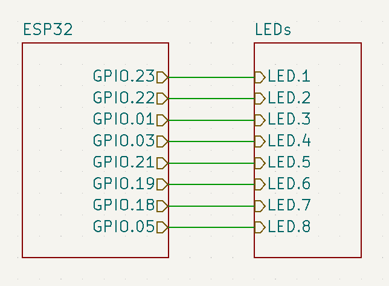
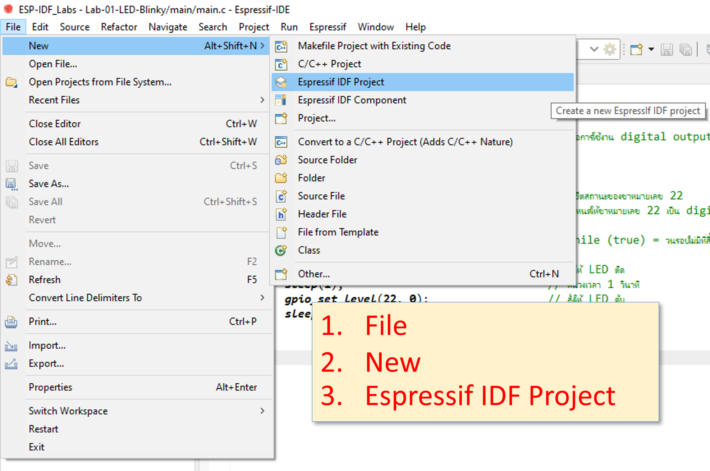
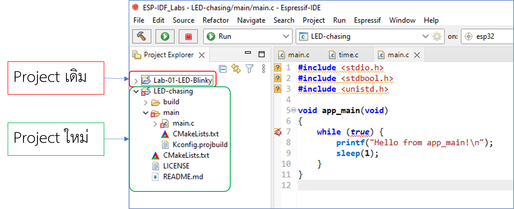

# IoT-ESP32-LabSheet-02
# โปรแกรมไฟวิ่ง 8 ดวง
## [(กลับไปหน้าที่แล้ว)](./README.md)
## 3. วงจรไฟวิ่ง 8 ดวงและการเขียนโปรแกรมควบคุม

### 3.1 รายการอุปกรณ์
1. บอร์ดทดลอง IoT KMITL FIGHT จำนวน 1 บอร์ด
2. สายต่อ USB Micro จำนวน 1 เส้น
3. สายต่อวงจรชนิด ผู้-ผู้ จำนวน 8 เส้น

### 3.2 เครื่องมือในการโปรแกรม
1. Computer หรือ Laptop ที่ติดตั้งโปรแกรม ESP-IDF ([ถ้ายังไม่ติดตั้งให้ติดตั้งตามใบงานนี้ (คลิก) ](https://github.com/Special-Topic-2565-01/ESP-IDF-Tool-setup) )

### 3.3 การประกอบวงจรสำหรับทดลอง
1. __ถอดสาย micro usb ที่ต่อระหว่างบอร์ดและคอมพิวเตอร์ออกก่อนประกอบวงจร__
2. ประกอบวงจรตามรูป

<p align="center">

</p>

### 3.3 สร้างโปรเจคใหม่สำหรับไฟวิ่ง 8 ดวง

1. เปิดโปรแกรม ESP-IDF 
2. สร้างโปรเจคใหม่ ชื่อ `LED-Chasing`   ([คลิกที่นี่เพื่อดูตัวอย่างขั้นตอนการสร้างโปรเจค](https://github.com/Special-Topic-2565-01/LabSheet-01))

<p align="center">

</p>

หลังจากสร้างโปรเจคใหม่จะได้หน้าจอในลักษณะนี้

<p align="center">

</p>


3. Double click ที่ main.c  ของโปรเจคใหม่ เพื่อแก้ไข source code ให้เป็นโปรแกรมไฟวิ่ง
4. ในบรรทัดที่ 4 ให้เพิ่ม 

```c
#include "driver/gpio.h" // เพื่อการใช้งาน digital output (GPIO)
```

5. เพิ่มบรรทัดคำสั่งควบคุม GPIO ให้ทำงานเป็น OUTPUT สำหรับต่อ LED จนครบ 8 ดวง

``` c
    void app_main(void)
    {

        // รีเซ็ตสถานะของ Pins
        gpio_reset_pin(23);
        gpio_reset_pin(22);
        gpio_reset_pin(1);
        gpio_reset_pin(3);
        gpio_reset_pin(21);
        gpio_reset_pin(19);
        gpio_reset_pin(18);
        gpio_reset_pin(5);

        // กำหนด Pins เป็น digital output
        gpio_set_direction(23, GPIO_MODE_OUTPUT);
        gpio_set_direction(22, GPIO_MODE_OUTPUT);
        gpio_set_direction(1, GPIO_MODE_OUTPUT);
        gpio_set_direction(3, GPIO_MODE_OUTPUT);
        gpio_set_direction(21, GPIO_MODE_OUTPUT);
        gpio_set_direction(19, GPIO_MODE_OUTPUT);
        gpio_set_direction(18, GPIO_MODE_OUTPUT);
        gpio_set_direction(5, GPIO_MODE_OUTPUT);

        // ส่วน while loop ไม่ได้แสดงในที่นี้
```

6. แก้ไข while loop ให้ LED เป็นไฟวิ่ง

``` c
    while (true)
    {
        gpio_set_level(23, 1);
        sleep(1);
        gpio_set_level(23, 0);
        sleep(1);
        gpio_set_level(22, 1);
        sleep(1);
        gpio_set_level(22, 0);
        sleep(1);
        gpio_set_level(1, 1);
        sleep(1);
        gpio_set_level(1, 0);
        sleep(1);
        gpio_set_level(3, 1);
        sleep(1);
        gpio_set_level(3, 0);
        sleep(1);
        gpio_set_level(21, 1);
        sleep(1);
        gpio_set_level(21, 0);
        sleep(1);
        gpio_set_level(19, 1);
        sleep(1);
        gpio_set_level(19, 0);
        sleep(1);
        gpio_set_level(18, 1);
        sleep(1);
        gpio_set_level(18, 0);
        sleep(1);
        gpio_set_level(5, 1);
        sleep(1);
        gpio_set_level(5, 0);
        sleep(1);
    }
```
7. Build และโปรแกรมลงบอร์ด สังเกตุ LEDs ว่าเป็นไฟวิ่งหรือไม่ ถ้ามี error ให้แก้ไขให้เป็นไฟวิ่ง

--- 
***โปรแกรมสมบูรณ์ของไฟวิ่ง 8 ดวง รุ่นที่ 1***

```c
#include <stdio.h>
#include <stdbool.h>
#include <unistd.h>
#include "driver/gpio.h"                        // เพื่อการใช้งาน digital output (GPIO)

void app_main(void)
{
    gpio_reset_pin(23);
    gpio_reset_pin(22);
    gpio_reset_pin(1);
    gpio_reset_pin(3);
    gpio_reset_pin(21);
    gpio_reset_pin(19);
    gpio_reset_pin(18);
    gpio_reset_pin(5);

    gpio_set_direction(23, GPIO_MODE_OUTPUT);
    gpio_set_direction(22, GPIO_MODE_OUTPUT);
    gpio_set_direction(1, GPIO_MODE_OUTPUT);
    gpio_set_direction(3, GPIO_MODE_OUTPUT);
    gpio_set_direction(21, GPIO_MODE_OUTPUT);
    gpio_set_direction(19, GPIO_MODE_OUTPUT);
    gpio_set_direction(18, GPIO_MODE_OUTPUT);
    gpio_set_direction(5, GPIO_MODE_OUTPUT);

    while (true)
    {
        gpio_set_level(23, 1);
        sleep(1);
        gpio_set_level(23, 0);
        sleep(1);
        gpio_set_level(22, 1);
        sleep(1);
        gpio_set_level(22, 0);
        sleep(1);
        gpio_set_level(1, 1);
        sleep(1);
        gpio_set_level(1, 0);
        sleep(1);
        gpio_set_level(3, 1);
        sleep(1);
        gpio_set_level(3, 0);
        sleep(1);
        gpio_set_level(21, 1);
        sleep(1);
        gpio_set_level(21, 0);
        sleep(1);
        gpio_set_level(19, 1);
        sleep(1);
        gpio_set_level(19, 0);
        sleep(1);
        gpio_set_level(18, 1);
        sleep(1);
        gpio_set_level(18, 0);
        sleep(1);
        gpio_set_level(5, 1);
        sleep(1);
        gpio_set_level(5, 0);
        sleep(1);
    }
}

```

---


## [4. ปรับปรุงโปรแกรมวงจรไฟวิ่ง 8 ดวง รุ่นที่ 2 (คลิกเพื่อเข้าสู่การทดลอง)](./Chasing-LED-V2.md)